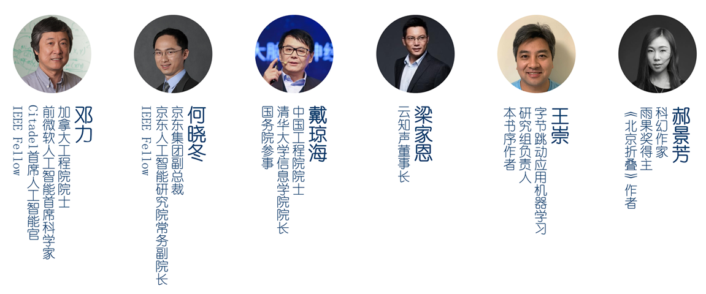

# [声纹技术：从核心算法到工程实践](media/poster.jpg)

## 购买方式

* 京东：
  * [https://item.jd.com/12970526.html](https://item.jd.com/12970526.html)
  * [https://item.jd.com/10021950029544.html](https://item.jd.com/10021950029544.html)
* 天猫：
  * [https://detail.tmall.com/item.htm?id=628032618898](https://detail.tmall.com/item.htm?id=628032618898)
  * [https://detail.tmall.com/item.htm?id=627394432450](https://detail.tmall.com/item.htm?id=627394432450)
* 当当：[http://product.dangdang.com/29130997.html](http://product.dangdang.com/29130997.html)

## 内容简介

这是第一本系统性地介绍声纹识别、声纹分割聚类及声纹在语音识别、语音合成、人声分离等领域中应用的技术书。本书内容全面且紧随时代前沿，不仅涵盖了早至20世纪60年代的经典方法，而且以大量篇幅着重介绍了深度学习时代的最新技术。本书注重理论与实践的结合，除了配备大量实践案例与习题，还有专门章节介绍声纹技术在实际工程部署方面的诸多课题。

本书面向大学与研究机构的学生、教研人员，以及企事业单位从事声纹技术相关工作的工程师、架构师和产品经理等。

ISBN：9787121395291

本书荣获电子工业出版社[**2020年度优秀作者奖**](media/PHEI_author_award.JPG)。

本书在[京东好物榜内容详细人工智能书籍TOP榜](https://ranking.m.jd.com/goodsLandingPage/goodsLandingPage?contentId=269860649)排行第11。

## 媒体报道

* [博文视点 - 声纹技术：让智能语音助手真正“认得”自己](https://mp.weixin.qq.com/s/ZjmzLRxxUbLwLSIH4u3X5g)
* [语音杂谈 -【好书推荐】《声纹技术》抽奖送书](https://mp.weixin.qq.com/s/xwjMlWeZO3azVw0TpwVfMw)
* [机器之心 - 从核心算法到工程实践，谷歌声纹识别负责人带你学习声纹技术（附赠书）](https://mp.weixin.qq.com/s/iQtHFi34uKTGfvWVOl8adw)
* [博文视点 - 读书节公开课丨王泉：入门声纹技术之音频基础与声纹识别](https://mp.weixin.qq.com/s/BoFXORh1mUgAPaC4Q80bQA)
* [机器之心 - 入门声纹技术（二）：声纹分割聚类与其他应用（附赠书）](https://mp.weixin.qq.com/s/5e-Pqu1VUDsU7fTtiD87rw)
* [博文视点 - 程序员读书节重磅直播丨王泉：入门声纹技术之声纹分割聚类与其他应用](https://mp.weixin.qq.com/s/fgKbkU5hp3kO5me7iChztA)
* [载思考 - 刷脸不够安全？配上声纹技术呢？](https://mp.weixin.qq.com/s/ZFBFM9FtcDqTSOYGttDDxw)
* [声纹圈 - 声纹技术宝典——《声纹技术：从核心算法到工程实践》](https://mp.weixin.qq.com/s/lYt0Teg_Pj4ponN-Jd-AXg)

## 教学视频

机器之心专栏：【[声纹技术入门2讲](https://app6ca5octe2206.pc.xiaoe-tech.com/detail/p_5fe1c1c3e4b0231ba88e490e/6)】

点击此处下载本书试读样章：【[下载链接](https://github.com/wq2012/VoiceIdentityBook/raw/master/media/声纹技术-样章.pdf)】

## 大咖推荐

> 随着智能语音助手的普及，声纹技术将成为人工智能领域的下一个增长点。本书系统地介绍了声纹领域的经典方法及学术前沿的研究成果。它从最基础的人耳听觉感知和音频信号处理讲起，除了介绍学术方面的内容，还专门介绍了声纹技术的工程部署，值得每一位语音领域的研究人员细读。
>
> **——加拿大工程院院士，Citadel首席人工智能官，IEEE Fellow  邓力**

> 本书全面而系统地介绍了前沿的声纹技术。更令人欣喜的是，对于这样一本颇具时代意义的书籍，作者选择以中文出版。《声纹技术：从核心算法到工程实践》一书的面世，无疑是国内声纹技术研究人员和开发人员的福音。
>
> **——京东集团副总裁，京东人工智能研究院常务副院长，IEEE Fellow  何晓冬**

> 声纹技术涉及大量学科的基础知识，且在最近几年发展迅猛，因此学习门槛非常高。本书从最基础的音频信号处理讲起，深入浅出地介绍了声纹识别技术，声纹分割聚类技术，以及声纹技术在语音识别、语音合成、人声分离等领域的应用。即使是语音方面的初学者，也能通过本书快速掌握核心概念和方法。此外，本书配备的编程案例和思考练习题，让本书十分适合作为高校本科生和研究生相关专业课的教材。
>
> **——中国工程院院士，清华大学信息学院院长  戴琼海**

> 本书从原理、算法到应用，对声纹识别和分割聚类等技术做了系统和深入浅出的阐述，既有理论深度，又有大量的编程实践和工程优化案例，是在校学生和相关工作者理解和掌握声纹技术及其应用不可多得的宝典。作者严谨务实的科研方法也值得借鉴。
>
> **——云知声董事长  梁家恩**

> 本书是这个领域一个重要的里程碑，填补了声纹技术专著方面的空白。本书将对相关技术的进一步快速普及和发展起到积极的推动作用，吸引更多的人才从事语音及声纹技术的研究和开发。
>
> **——字节跳动应用机器学习研究组负责人  王崇**

>本书介绍的声纹技术前沿进展，包括声纹克隆和人声分离等令人印象深刻的应用，让我不禁对其未来展开无限遐想。相信不久之后，能与人们自然地对话，并通过声音来辨别我们每一个人的人工智能将成为现实。更令我期待的是，在人类步入宇宙时代并能够与地外文明进行交流的未来，声纹技术又会在其中发挥怎样的作用。
>
> **——科幻作家，雨果奖得主  郝景芳**

## 思考与练习参考答案

### 第一章

#### 练习 1.1 指纹与声纹作为两种生物识别特征，它们之间有哪些相同点和不同点？

相同点：

* 都属于生物识别特征，可用于区别不同人的身份。

不同点：

* 指纹属于生理特征，声纹通常被认为属于行为特征。
* 指纹比较直观，是一种看得见、摸得着的特征。
* 一个人的指纹通常不会改变，但声纹是可能会变化的，见第7.2.2节。

#### 练习 1.2 哪些方面的因素可能导致两个人之间的声纹差异？

* 发音器官，包括声带、 声管等，在大小和形状上的差异。
* 性别与年龄。
* 不同地域的发音方式（例如，北京的儿化音、湖北当阳的弹舌音等），以及方言和土语。

#### 练习 1.3 下载开源音频编辑软件Audacity，熟悉其界面与基本操作，尝试用其录制一段音频，并分别采用波形视图和时频谱视图对其进行可视化。

动手实践。略。

#### 练习 1.4 声纹识别的模板匹配法有哪些缺陷？早期的统计学方法又有哪些缺陷？

模版匹配方法的缺陷：

* 仅限于文本相关的声纹识别，无法用于文本无关的声纹识别。
* 难以解决“对齐”的问题。
* 没有考虑到语音信号可能出现的变化。

早期统计学方法的缺陷：

* 模型过于简单。
* 统计过程中丢失了时序信息。

#### 练习 1.5 调研国内市场上的智能音箱产品。其中有哪些产品支持声纹识别功能？

开放问题。略。

---

### 第二章

#### 练习 2.1 语音信号在产生的过程中，以及被感知的过程中，分别要经过人体的哪些器官？

产生过程：肺部排出气流，声带振动，再经过由喉腔、咽头、口腔和鼻腔等所构成的声道。

感知过程：外耳（包括耳翼、外耳道和鼓膜），中耳（包括三块听小骨），内耳（包括耳蜗）。

#### 练习 2.2 汉语拼音的声调，对应的是语音信号的哪种特征？

基音轨迹。见参考文献[29]。

#### 练习 2.3 人耳听觉的非线性是由哪些因素造成的？

* 外耳道部分可以被看作一条管道，因此也具有许多共振频率，会对某些频率的声音进行放大。
* 当声强超出一定范围时，听小骨传递的振动会变成非线性的，从而达到保护内耳的作用。
* 耳蜗中不同位置的毛细胞，对应着不同频率的声音。这个分布大致是按频率的对数（而非线性）分布的。

#### 练习 2.4 动圈式麦克风的工作原理是什么？与电容式麦克风相比，动圈式麦克风有哪些优缺点？

原理：声波导致振膜振动，从而导致线圈移动，从而切割磁场中的磁力线而产生感应电流。

优点：无需直流工作电压。

缺点：灵敏度（瞬态响应）和扩展后的高频（有时也会是低频）响应方面不如电容式麦克风。

#### 练习 2.5 编写一段程序，利用μ-law变换的公式，将16位线性脉冲编码格式存储的音频转换为8位非线性脉冲编码格式，并比较转换前后音频的声音质量及文件大小。

编程题。略。

#### 练习 2.6 窗函数的作用是什么？有哪些常见的窗函数？

作用：避免在分帧后的信号上直接计算傅里叶变换导致的吉布斯现象和频谱泄漏所带来的负面影响。

#### 练习 2.7 编写一段程序，用以计算一段有限离散信号的离散傅里叶变换。

编程题。

C++实现可以参考：https://www.tutorialspoint.com/cplusplus-program-to-compute-discrete-fourier-transform-using-naive-approach

快速傅里叶变换可以参考：https://rosettacode.org/wiki/Fast_Fourier_transform

#### 练习 2.8 感知线性预测与梅尔倒谱系数在设计与实现上有哪些相同点与不同点？

见表2.3。

#### 练习 2.9 除了LibROSA，还有一些基于Python语言的音频特征提取工具库。下载并熟悉 pyAudioAnalysis与python_speech_features工具库，利用其从音频中提取特征并进行可视化。

编程题。略。

---

### 第三章

#### 练习 3.1 声纹验证与声纹辨认的区别是什么？它们分别适用于哪些应用场景？

声纹验证只关心某个特定的说话人，可以被看作二值判别的问题。声纹辨认一般会有多个候选说话人。

声纹验证对应的应用主要是唤醒和安全。声纹辨认对应的应用场景主要是个性化。

#### 练习 3.2 相比文本相关的声纹识别，文本无关的声纹识别有哪些难点？

见第57页。文本无关的声纹识别的难点有：

1. 声纹录入时用户提供的音频与验证时的音频，其所对应的文本不同。
2. 训练时难以同时覆盖所有说话人和所有内容。
3. 我们无法预知 用户将要提供的音频的具体长度。

#### 练习 3.3 为何在声纹识别中，我们偏好于使用余弦相似度而非欧氏距离作为我们的相似度量？

余弦相似度有固定的取值范围[-1,1]，比较便于选取全局的判别阈值。

#### 练习 3.4 如何理解等错率这一声纹识别评价指标？

见第3.2.4节。

#### 练习 3.5 尝试编写程序实现高斯混合模型及其参数估计方法。

编程题。

可以参考scikit-learn的官方实现：https://github.com/scikit-learn/scikit-learn/blob/0fb307bf3/sklearn/mixture/_gaussian_mixture.py

#### 练习 3.6 如何理解非线性支持向量机所采用的核技巧？

见第73页。我们希望将特征空间进行某种非线性变换。但通过核技巧，我们并不需要真的找出显式的非线性变换。

#### 练习 3.7 与其他声纹识别方法相比，深度学习方法的优势在哪里？

* 能够很容易地构建包含大量参数的复杂模型。
* 卷积神经网络、循环神经网络等能够更好地对多维或时序信号建模的模型。
* 专用硬件的支持，海量数据的存在，以及众多优秀的软件框架。

#### 练习 3.8 如何理解“卷积神经网络实现了空间上的参数复用，而循环神经网络实现了时间上的参数复用”这句话？

卷积神经网络可以将同样的卷积内核应用到数据的不同位置，从而实现空间上的参数复用。

循环神经网络可以将同样的参数应用于时序信号的不同时间点，从而实现时间上的参数复用。

#### 练习 3.9 用于声纹识别的神经网络有哪些运行时的推理逻辑？每种推理逻辑的优缺点分别是什么？

见第3.4.3节。运行时的推理逻辑包括：各帧独立的逐帧推理，固定窗推理，全序列推理，以及滑动窗推理。

#### 练习 3.10 利用交叉熵损失函数训练声纹识别神经网络有哪些缺点？

优点：便于理解，容易实现。

缺点：

* 难以在闭集之外的说话人上取得较好的效果。
* 训练数据规模较大时，面临巨大的参数量及计算量。

#### 练习 3.11 尝试编写程序，根据式(3.55)实现一个简单的数据增强工具。

编程题。略。

#### 练习 3.12 分数正则化的好处是什么？有哪些分数正则化的方法？

好处：将不同说话人的验证分数的差异化考虑到判别过程中，从而减轻全局阈值所带来的问题。

方法：Z-norm，T-norm，TZ-norm，S-norm。

#### 练习 3.13 下载LibriSpeech数据集，用音频处理库LibROSA从每段音频中提取MFCC特征，利用任意一种运行时推理逻辑和任意一种损失函数，在该数据集上训练一个声纹识别神经网络模型。

编程题。

MFCC特征的提取见本书第2.5.7节。

神经网络的实现可以参考此处列出的诸多开源实现：https://github.com/wq2012/awesome-diarization#speaker-embedding

#### 练习 3.14 下载参考文献[105]中所描述的Audio Set音频数据集，并提取其中的非语音音频作为我们的噪声源数据。利用pyroomacoustics工具库，随机生成大量的房间，并通过下载的噪声源，对LibriSpeech进行数据增强，构建一个增强后的数据集。

编程题。

可参考本书107-109页所介绍的数据增强实例。如果Audio Set数据集不方便下载，也可以使用[MUSAN](https://www.openslr.org/17/)数据集。

#### 练习 3.15 在练习3.13与练习3.14的基础上，在增强后的LibriSpeech数据上训练一个新的声纹识别神经网络模型，并将新的模型与未进行数据增强时的模型进行比较。

编程题。略。

---

### 第四章

#### 练习 4.1 在过去的学习、研究、工作经历中，你接触或使用过哪些软件工程技术？这些技术为你的项目带来了哪些帮助？

开放问题。略。

#### 练习 4.2 声纹识别与语音识别有哪些协同运作的方式？

见129-131页。声纹识别与语音识别的协同运作有：

1. 语音识别系统，尤其是语言模型部分，可能依赖于声纹识别的结果。
2. 语音识别与声纹识别之间也可能存在竞争冒险。

#### 练习 4.3 如何理解流式信号处理？在哪些应用中需要用到流式信号处理？

见第4.2.3节。在线应用需要用到流式信号处理，即音频数据一边产生，一边作为语音处理引擎的输入，并得到实时的处理结果。

#### 练习 4.4 你是否接触过其他采用计算图这种设计模式的案例？试分析该案例为何采用这种设计模式。

开放问题。略。

#### 练习 4.5 为何认为模型版本迭代是声纹识别工程部署中最大的挑战之一？

声纹识别包含了录入与识别这两个阶段。一旦我们更换了新的声纹识别模型，已有的说话人模型将全部失效。这是声纹识别问题与语音识别等其他语音问题的最大区别。

#### 练习 4.6 离线指标与在线代理指标的区别是什么？

离线指标：通过在专门的测试数据集上运行声纹识别系统，并根据测试数据中包含的真实说话人身份信息计算得到。

在线代理指标：用于真实使用场景，由于无法获取验证音频的真实说话人身份，只能间接、近似地反映声纹识别产品的性能。

#### 练习 4.7 声纹识别的产品部署方式主要分为哪三种？分类的依据是什么？

部署方式：全设备端部署，全服务器端部署，复合式部署。

分类依据：

1. 完成信号处理、特征提取及神经网络模型推理等任务的语音处理引擎在什么机器上运行。
2. 用户的说话人模型存储在什么机器上。

#### 练习 4.8 编写一段程序，将两个32位浮点实数矩阵的乘法，用8位无符号整数的乘法来实现，并比较量化前后矩阵乘法结果的精度差异。

编程题。见第141-143页。

#### 练习 4.9 什么是负载均衡？负载均衡有哪些简单的实现方法？

见第4.4.3节。实现方法：轮转法，哈希法，自适应法。

#### 练习 4.10 在声纹识别的全服务器端部署中，如何避免单点故障？

见第4.4.3节。

避免方法：

* 数据库实时备份。
* 主数据库与备用数据库实现物理上的隔离。
* 后台运行监视器进程。
* 准备备用负载均衡器。

---

### 第五章

#### 练习 5.1 声纹分割聚类的通用架构由哪些模块构成？

见图5.3。包括：语音检测，语音分割与说话人转换检测，声纹嵌入码，聚类分析，以及二次分割。

#### 练习 5.2 除了声纹分割聚类，还有哪些多说话人识别的技术？这些技术与声纹分割聚类之间的主要区别分别是什么？

其他多说话人识别技术包括声源分离，连续声纹识别，说话人转换检测。区别详见5.2节。

#### 练习 5.3 聚类问题与分类问题的区别是什么？监督式聚类问题与前两者的区别又是什么？

聚类问题与分类问题的区别见第5.3.1节。聚类问题属于非监督式学习，分类属于监督式学习。分类问题中的类别一般是有明确意义的。聚类问题中，每一个聚类仅表示其在当前特定的数据集合中，与其他数据有所区分，但并没有明确的意义。

监督式聚类问题见第5.5.2节。在监督式聚类问题中，训练数据中的基本事实，不再是每一个单独数据点的类别标签，而是一组数据点作为一个集合，其中每一个点的标签。也就是说，监督式聚类问题存在着标签歧义性。

#### 练习 5.4 利用在线聚类的通用接口，编程实现Naive聚类方法。

编程题。略。

#### 练习 5.5 利用离线聚类的通用接口，编程实现聚合式分层聚类及K-均值聚类方法。

编程题。

聚合式分层聚类可以参考:
* scikit-learn的官方实现：https://github.com/scikit-learn/scikit-learn/blob/0fb307bf3/sklearn/cluster/_agglomerative.py

K-均值聚类可以参考:
* scikit-learn的官方实现：https://github.com/scikit-learn/scikit-learn/blob/0fb307bf3/sklearn/cluster/_kmeans.py
* 多种语言的实现：https://rosettacode.org/wiki/K-means%2B%2B_clustering

#### 练习 5.6 参考5.3.4节介绍的方法，编程实现基于K-均值聚类的在线聚类方法。

编程题。略。

#### 练习 5.7 传统的非监督式聚类方法应用于声纹分割聚类问题时，面临哪些局限？

见第5.5.1节。传统的非监督式聚类方法无法从训练样本中学习，也无法利用时序信息。

#### 练习 5.8 什么是声纹分割聚类问题中的标签歧义性？不同的监督式方法如何克服标签歧义性问题？

见第185页。标签歧义性指标签只在一个集合或序列的内部才有意义。不同集合或序列之间的标签无法相互比较。

如何克服：

* 无界交织态循环神经网络：逐一生成新的说话人。
* 判别神经聚类：基于顺序的类别标签。
* 置换不变性训练：标签歧义性不对损失函数造成影响。

#### 练习 5.9 什么是贝叶斯非参数模型？中餐馆过程和印度自助餐过程有何异同？

见第187页。贝叶斯非参数模型通过数据本身决定模型的复杂程度。

#### 练习 5.10 无界交织态循环神经网络中的说话人转换模型，和通常我们所说的说话人转换检测是什么关系？

无界交织态循环神经网络中的说话人转换模型只是一个表示说话人转换的简单概率分布。

说话人转换检测是一种可以从语音数据中检测出说话人发生转换的时刻的独立模型。

#### 练习 5.11 阅读谷歌在GitHub网站上发布的无界交织态循环神经网络开源实现的说明文档，了解其基本 API，并下载、运行示例程序。

动手实践。略。

#### 练习 5.12 证明基于分配矩阵的置换不变性损失函数及深度聚类损失函数满足置换不变性。

见第197-198页。

#### 练习 5.13 有哪些声纹分割聚类与语音识别的联合训练方法？

见第5.5.7节。有两种方法：多任务学习方法和序列转换器方法。

#### 练习 5.14 通过Python科学计算库SciPy中的分配问题优化算法，实现一个简单的用于计算分割聚类错误率的函数。

参考开源实现：https://github.com/wq2012/SimpleDER

#### 练习 5.15 通过练习3.15中训练的声纹识别神经网络及练习5.5中实现的K-均值聚类，实现一个简单的非监督式声纹分割聚类系统，并用练习5.14中实现的方法评价其分割聚类错误率。

编程题。略。

---

### 第六章

#### 练习 6.1 传统语音识别框架通常由哪些模块构成？端到端语音识别有哪些方法？

传统语音识别框架包含声学模型，上下文模型，发音模型，和语言模型。

端到端语音识别的方法有：基于连接时域分类的模型，基于注意力模型的“听-注意-拼写”模型，以及循环神经网络转换器模型等。

#### 练习 6.2 传统语音合成框架通常由哪些模块构成？端到端语音合成框架通常由哪些模块构成？

传统语音合成框架包含文本正则化，音素分析，韵律分析和波形合成。

端到端语音合成框架由编码器、解码器和声码器构成。

#### 练习 6.3 个性化语音检测与声纹识别、声纹分割聚类这两类问题的区别是什么？

见第6.4.2节以及参考文献[184]。与声纹识别相比，个性化语音检测模型的大小和计算成本要低很多。与声纹分割聚类相比，个性化语音检测只关心目标说话人，不需要区分其他说话人。

#### 练习 6.4 与盲式人声分离相比，定向人声分离有哪些优势？

见第6.5.2节。优势有：

1. 输出目标明确，分离完成之后无须额外的甄别筛选过程。
2. 无须提前知道输入信号中包含多少个说话人。

#### 练习 6.5 声纹转换与声纹克隆有哪些异同？

相同点：两者都需要用某个特定说话人的声音生成语音。

不同点：

* 声纹转换是给定说话人A说的一段语音，将其声音变为说话人B。但是诸如语义内容等与声纹无关的信息却保持不变。
* 声纹克隆是给定说话人A说的一段语音，然后生成说话人A说出的任何语音内容。声纹保持不变。

#### 练习 6.6 如何理解声纹还原度测试？除了音频编码和多说话人语音合成，还有哪些应用可以考虑采用声纹还原度测试？

开放问题。略。

---

### 第七章

#### 练习 7.1 在哪些情况下，同一说话人的声纹特征会出现较大的变化？

见第7.2.2节。情绪、健康状况、精神状况、生理成长和行为都会导致同一说话人的声纹特征出现变化。

#### 练习 7.2 利用LibROSA等工具库从音频中提取时频谱特征，然后基于该时频谱特征编程实现三种时频谱增强的方法，并对增强后的时频谱进行可视化。

编程题。

时频谱增强部分可以参考Lingvo的开源实现：https://tensorflow.github.io/lingvo/_modules/lingvo/core/spectrum_augmenter.html

#### 练习 7.3 针对声纹识别系统的欺诈攻击分为哪几类？

见第7.2.3节。从访问方式上，分为物理访问攻击和逻辑访问攻击。从具体形式上，分为人为冒名顶替、转录、语音合成、声纹转换这四种。

#### 练习 7.4 对抗学习在声纹识别领域有哪些应用？

* 可用于为每个说话人生成更多的声纹嵌入码。见参考文献[212]。
* 用来提升声纹识别模型对信道变化的鲁棒性。见参考文献[214]。
* 可用于领域对抗训练。见参考文献[215]。

#### 练习 7.5 联邦学习应用于声纹识别问题时，相比于语音识别等其他问题，面临哪些新的挑战？

见第7.4.3节。声纹识别的本地数据难以通过单一客户端获取，而是最好基于由若干个客户端组成的小型集群，并允许集群内的本地数据共享，以对应于训练数据的一小批次数据。

#### 练习 7.6 集成学习的方法有哪些？如何将集成学习应用于声纹识别问题？

见第7.4.4节。比较著名的集成学习方法有Bootstraping和Boosting。

当我们将集成学习应用于声纹识别模型的时候，集成的目标可以是最终的声纹验证判别结果，也可以是识别的余弦相似度。

#### 练习 7.7 同时完成声纹分割聚类与人声分离这两个任务时，通常会遇到哪些挑战？

见第7.4.5节。同时完成声纹分割聚类与人声分离这两个任务时，面临的挑战包括：

* 在进行人声分离之前，需要先知道音频中的哪些部分包含了重叠的音频，以及每一个重叠音频部分包含了多少个说话人的语音信号。
* 在将重叠音频分离之后，需要将这些分离后的信号与音频中的其他部分联系起来，并保证声纹分割聚类及语音识别的连贯性。

## 内容勘误

### 2.2.3节

第17页，此处“傅里叶变化”应为“傅里叶变换”。

### 2.3.3节

第32页，差分脉冲编码的英文应该为differential PCM，而非difference PCM。

### 3.2.4节

第62页，正确的英文应该为：
* 错误接收率：false accept rate，FAR
* 错误拒绝率：false reject rate，FRR
* 正确接受率：true accept rate，TAR
* 正确拒绝率：true reject rate，TRR

第63页和64页的所有FA应改为FAR，所有FR应改为FRR。（第62页FA与FR分别被称作第一类错误与第二类错误的说法不需要改）

第63页，当以FAR为横坐标，FRR为纵坐标时，此时的曲线名称为**检测错误权衡**（detection error tradeoff，DET）曲线，而不再是ROC曲线。

此外，这句话有误，应该删除：“值得注意的是，因为等错率表示FA与FR相等时的数值，所以在等错率阈值这一点，真正的错误率是FA与FR之和，也就是等错率的两倍，而非等错率本身。”

### 3.3.4节

第73页，“非线性变化”应为“非线性变换”。

### 3.4.3节

第92页，“100/N次推理”应为“100/(100-N)次推理”。

### 3.5.3节

第107页，等式（3.55）等号右边，求和符号的下标应该是i=1，求和符号后面的h下边应该为i而非t。

### 3.7.1节

第115页，斯坦福国际研究所的英文应为SRI International。